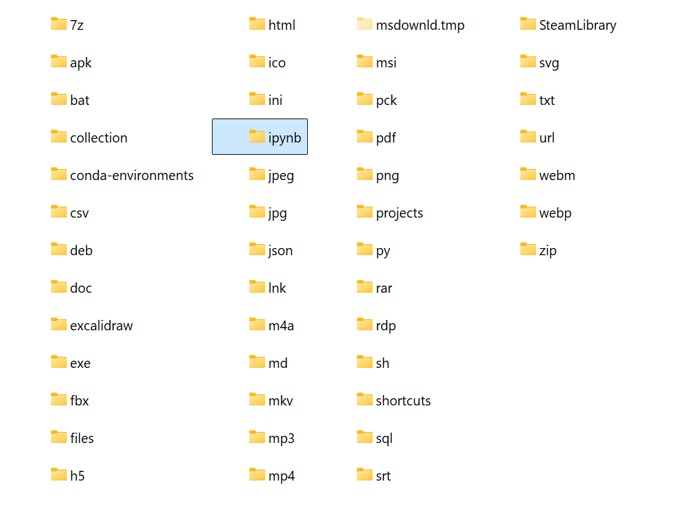

# file organizer

this python script automatically organizes files in a directory based on their extensions. it creates folders for each file type and moves files into their respective folders. the script also handles files without extensions and existing directories.

## features

- organizes files based on their extensions
- creates a separate folder for files without extensions
- moves existing directories to a "collection" folder
- ignores the script file itself and the configuration file
- dynamically updates the list of file extensions in the configuration file

## how it works

1. the script reads a `config.json` file to get the list of known file extensions.
2. it scans the current directory for files and folders.
3. for each file:
   - if it has no extension, it's moved to a "files" folder.
   - if it has an extension, a folder is created for that extension (if it doesn't exist), and the file is moved there.
   - new extensions are added to the configuration file.
4. existing folders (except "collection" and the no-extension folder) are moved to a "collection" folder.

## usage

1. place the `organize-files.py` script in the directory you want to organize.
2. create a `config.json` file in the same directory with an empty list of file extensions:
   ```json
   {
     "file_extensions": []
   }
   ```
3. run the script:
   ```
   python organize-files.py
   ```

## result

after running the script, your directory will be organized like this:



## note

make sure to backup your files before running this script, as it moves files and folders within the directory.

## requirements

- python 3.x
- no additional libraries required (uses only built-in modules)

## contributing

feel free to fork this project and submit pull requests with improvements or bug fixes.

## license

this project is open source and available under the [mit license](license).
